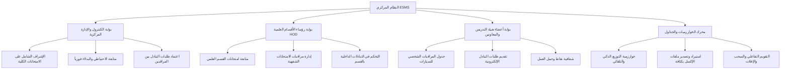
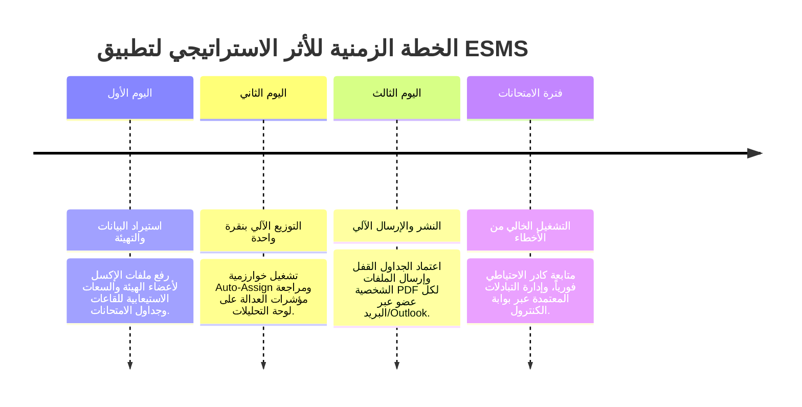

# التقرير التنفيذي والإداري الشامل وتحليل التحول الرقمي الاستراتيجي
**نظام إدارة ومراقبة الامتحانات الكلية (ESMS - Faculty Exam Supervision & Proctoring System)**

---

### الملخص التنفيذي وبيان الأهمية والاستعجال

في مؤسسات التعليم العالي الحديثة، تشكل إدارة مراقبات واختبارات الامتحانات الكلية يدويًا (باستخدام جداول الإكسل التقليدية، أو القوائم الورقية، أو المراسلات غير التنسيقية) ثغرة تشغيلية وتنظيمية خطيرة. تتطلب لوجستيات الامتحانات الكلية إدارة مئات الأعضاء من الهيئة التدريسية والمعاونة عبر عشرات القاعات الامتحانية، مع الموازنة بين قيود معقدة (مثل نوع التوظيف، الحالات الصحية، إجازات رعاية الأطفال والساعات المخصصة للأمهات، المسميات الوظيفية، وطبيعة الامتحانات الشفهية مقابل التحريرية)، كل ذلك مع ضمان العدالة المطلقة في توزيع أحمال العمل.

إن **نظام إدارة ومراقبة الامتحانات الكلية (ESMS)** هو تطبيق ويب رقمي متكامل تم تصميمه هندسيًا بمواصفات قياسية لمؤسسات التعليم العالي، للانتظام والتحول الكامل من العمليات اليدوية المجهدة والعرضة للأخطاء إلى **بيئة رقمية ميكانيكية، شفافة، وقابلة للمراجعة والتدقيق الكامل**.

يُعد تطبيق هذا النظام ضرورة استراتيجية عاجلة لقيادة الكلية (السادة العمداء، نواب العمداء لشؤون التعليم والطلاب، رؤساء الأقسام العلمية، ولجان الكنترول المركزية) لتحقيق **التحول الرقمي الشامل، والقضاء على الاختناقات الإدارية، والحفاظ على رضا أعضاء الهيئة التدريسية، وضمان النزاهة الأكاديمية المطلقة**.

---

### 1. المواصفات الفنية والمهندسة التقنية للنظام (System Specs)

تم بناء نظام ESMS على حزمة تقنية حديثة عالية الأداء مخصصة للأمان والسرعة والتكامل التلقائي:

*   **إطار العمل المتقدم (Frontend Framework)**: تم استخدام [Next.js 15 (App Router)](file:///d:/HUE/DEVELOPED%20SOFTWARE/Supervisors%20Automated%20Assign/app/page.tsx) بلغة **TypeScript**، مما يوفر سرعة معالجة فائقة، وعرض مباشر من الخادم، وأمان كامل للبيانات عبر جميع الشاشات.
*   **التصميم والواجهات الرقمية (UI/UX)**: تم استخدام **Tailwind CSS** بنظام ألوان معتمد لمؤسسات التعليم العالي (الكحلي الملكي `#00122e` مع التوهج الذهبي)، مع واجهات تفاعلية وسريعة الاستجابة تدعم الهواتف والأجهزة اللوحية والمكتبية.
*   **قواعد البيانات والمحرك الأمني**: تعتمد المنظومة على [Supabase PostgreSQL](file:///d:/HUE/DEVELOPED%20SOFTWARE/Supervisors%20Automated%20Assign/supabase/migrations/001_initial_schema.sql) المزود بسياسات الأمان على مستوى السطر (Row Level Security - RLS)، والدوال البرمجية المباشرة داخل قاعدة البيانات، ونظام تتبع التغييرات التلقائي غير القابل للتزوير ([audit_log](file:///d:/HUE/DEVELOPED%20SOFTWARE/Supervisors%20Automated%20Assign/types/database.types.ts#L208)).
*   **إدارة الحالة وتدفق البيانات**: استخدام **Zustand** لإدارة الحالة التفاعلية للجداول، مع **React Query** لاسترجاع وتحديث البيانات فورياً دون الحاجة لإعادة تحميل الصفحة.
*   **إصدار التشارير وتوزيع الجداول**: دمج مكتبات [jsPDF](file:///d:/HUE/DEVELOPED%20SOFTWARE/Supervisors%20Automated%20Assign/lib/utils/report-generators.ts) و **html2canvas** لإصدار جداول PDF رسمية وملفات إكسل بنقرة زر، مع محرك إرسال بريدي متطور في [route.ts](file:///d:/HUE/DEVELOPED%20SOFTWARE/Supervisors%20Automated%20Assign/app/api/send-schedule/route.ts) يدعم الربط المباشر ببروتوكول SMTP وكذلك الأتمتة المباشرة لتطبيق **Windows Outlook Desktop** عبر سكربت PowerShell تلقائي (`send-outlook.ps1`).

---

### 2. بنية البوابات التخصصية وأدوار المستخدمين (Multi-Portal Architecture)

يوفر نظام ESMS بوابات رقمية مخصصة لكل فئة من أصحاب المصلحة في الكلية، مما يضمن حصول كل جهة إدارية على الواجهة المتوافقة تمامًا مع صلاحياتها:

1.  **بوابة الكنترول والإدارة المركزية ([app/control-portal/page.tsx](file:///d:/HUE/DEVELOPED%20SOFTWARE/Supervisors%20Automated%20Assign/app/control-portal/page.tsx))**:
    *   مصممة لرئيس لجنة الامتحانات والكنترول والمسؤولين الإداريين.
    *   توفر تحكمًا كاملاً في جداول القاعات اليومية، وتوزيع كادر الاحتياطي، والبت في طلبات التبادل عبر الأقسام، واستخراج التقارير الرسمية الكلية.
2.  **بوابة رؤساء الأقسام العلمية ([app/hod-portal/page.tsx](file:///d:/HUE/DEVELOPED%20SOFTWARE/Supervisors%20Automated%20Assign/app/hod-portal/page.tsx))**:
    *   تمكّن رؤساء الأقسام من متابعة مراقبات أعضاء قسمهم، وإدارة امتحانات الشفهي، ومتابعة البدلاء، وتحميل جداول القسم بصيغة PDF.
3.  **بوابة أعضاء هيئة التدريس والهيئة المعاونة ([app/staff-portal/page.tsx](file:///d:/HUE/DEVELOPED%20SOFTWARE/Supervisors%20Automated%20Assign/app/staff-portal/page.tsx))**:
    *   مركز خدمة ذاتية للأساتذة، المدرسين، الهيئة المعاونة (المعيدين والمدرسين المساعدين)، والكيميائيين.
    *   تتيح استعراض الجدول الشخصي، واستلام إشعارات الاحتياطي، وتحميل ملف PDF فردي، وتقديم طلب تبادل مراقبة مع زميل بضغطة زر.
4.  **منصة التحليلات ومؤشرات الأداء ([app/analytics/page.tsx](file:///d:/HUE/DEVELOPED%20SOFTWARE/Supervisors%20Automated%20Assign/app/analytics/page.tsx))**:
    *   لوحة تحليلات تنفيذية تستخدم الرسوم البيانية التفاعلية لعرض توزيع أحمال العمل، ونسب العدالة بين الأعضاء، وتوزيع الكثافة الطلابية على المباني والقاعات.

---

### 3. تحليل عميق: خوارزمية التوزيع التلقائي الذكية (Auto-Assignment Engine)

في قلب النظام تقبع خوارزمية الرياضيات البرمجية المسؤولة عن التوزيع التلقائي والموجودة في ملف [auto-assignment.ts](file:///d:/HUE/DEVELOPED%20SOFTWARE/Supervisors%20Automated%20Assign/lib/algorithms/auto-assignment.ts)، والتي تطبق كافة القواعد والأحكام الأكاديمية والصحية في أجزاء من الثانية:

#### أ. معادلة نسب التواجد والعمالة بالقاعات (Staffing Ratios)
تتحدد احتياجات القاعة امتحانيًا بناءً على أعداد الطلاب المسجلين:
*   **من 1 إلى 9 طلاب**: رئيس قاعة واحد (Head Supervisor).
*   **من 10 إلى 30 طالبًا**: رئيس قاعة واحد + مراقب مساعد واحد (Invigilator/Assistant).
*   **من 31 إلى 50 طالبًا**: رئيس قاعة واحد + 2 مراقبين مساعدين.
*   **من 51 إلى 60 طالبًا**: رئيس قاعة واحد + 3 مراقبين مساعدين.
*   **أكثر من 61 طالبًا**: رئيس قاعة واحد + 4 مراقبين مساعدين.
*   **الامتحانات الشفهية (Oral Exams)**: يتم تعيين مراقب مساعد واحد فقط تلقائيًا وبدون رئيس قاعة.

#### ب. نظام النقاط الشفاف لتحقيق العدالة المطلقة
لضمان التوزيع العادل، تضيف كل مراقبة نقاطًا إلى سجل العضو:
*   **مراقبة رئيس قاعة / مشرف لجان**: $+2.0\text{ نقطة}$
*   **مراقبة كمراقب مساعد / ملاحظ**: $+1.0\text{ نقطة}$
*   **تكليف كعضو احتياطي للفترة**: $+0.25\text{ نقطة}$

تعطي الخوارزمية الأولوية التلقائية للأعضاء صاحبِي أقل رصيد نقاط فعلي ($\text{النقاط الفعلية} = \text{النقاط الحالية} + 0.25 \times \text{نقاط الاحتياطي}$). كما يمكن تفعيل سقف أقصى للعدالة (`max_score_delta_from_average`) لمنع تكليف أي عضو بمراقبات إضافية إذا تجاوز متوسط الكلية بفارق محدد، حتى يتساوى معه باقي الزملاء.

#### ج. تدرج الأدوار والقواعد الخاصة
*   **مشرفو اللجان (Committees Supervisors)**: يتم توزيعهم في مرحلة تمهيدية أولى؛ حيث يتولى مشرف اللجان التغطية لمجموعة قاعات تصل إلى 5 قاعات موزعة على دورين متجاورين كحد أقصى في نفس المبنى.
*   **مراعاة الحالات الصحية والتوزيع الجغرافي**: الأعضاء المسجلين بحالات صحية خاصة (`has_health_issue = true`) يتم توجيههم تلقائيًا للقاعات القريبة من الخدمات الطبية والصيدلية (مباني M و P) وتجنيبهم المباني البعيدة.
*   **حماية ساعات أمهات الرعاية (Feeding Mother Protection)**: تتبع ساعات المغادرة المبكرة (ساعتين مبكرًا ليومين أو ساعة مبكرًا لـ 4 أيام) بناءً على طبيعة التفرغ (دوام كامل / دوام جزئي).
*   **معامل الأعباء الزائدة (Overload Factor)**: تقليل احتمالية تكليف الأعضاء الذين يعانون من أعباء تدريسية مضاعفة بنسبة مئوية رياضية دقيقة.
*   **التوزيع على مرحلتين (Two-Phase Batch Assignment)**:
    1.  *المرحلة الأولى*: حجز وتكليف رؤساء القاعات لجميع الامتحانات أولاً لضمان توفير الكفاءات الرئيسية.
    2.  *المرحلة الثانية*: توزيع المراقبين المساعدين والملاحظين من بقية القوة المتاحة.
    3.  *المرحلة الثالثة*: توزيع قوة الاحتياطي (3 إلى 5 أعضاء احتياطي لكل فترة امتحانية) للتعامل مع أي غيابات طارئة.

---

### 4. جدول مقارنة الفجوات الإدارية: الإدارة اليدوية مقابل نظام ESMS

يُظهر الجدول التالي مقارنة تفصيلية بين نظام العمل اليدوي التقليدي القائم على الإكسل، وبين الحل الرقمي الذكي لنظام ESMS، مما يوضح **أهمية واستعجال اعتماد النظام للتحول الرقمي بالكلية**:

| البعد التشغيلي والإداري | الوضع الحالي: الجداول اليدوية والإكسل | حل التحول الرقمي الذكي (ESMS) | الأثر الإداري والاستراتيجي |
| :--- | :--- | :--- | :--- |
| **1. عدالة توزيع أحمال العمل** | شعور عام بعدم العدالة؛ الجداول اليدوية ترهق أعضاء الهيئة المعاونة بينما يحصل البعض على مراقبات أقل. | توزيع رياضي مبني على النقاط الشفافة ([auto-assignment.ts](file:///d:/HUE/DEVELOPED%20SOFTWARE/Supervisors%20Automated%20Assign/lib/algorithms/auto-assignment.ts#L494)) يضمن التساوي المطلق في العبء. | القضاء على الشكاوى والاعتراضات، وبناء الثقة والشفافية التامة داخل الأقسام. |
| **2. الأخطاء البشرية والتضارب** | ملفات الإكسل لا تكتشف التعارضات كتعيين نفس العضو في قاعتين بنفس الوقت أو تكليفه بفترات متتالية مجهدة. | محرك القيود المباشر ([isStaffAvailable](file:///d:/HUE/DEVELOPED%20SOFTWARE/Supervisors%20Automated%20Assign/lib/algorithms/auto-assignment.ts#L188)) يمنع التضارب والازدواجية ويضمن الفواصل الزمنية. | منع الارتباك يوم الامتحان، والقضاء على التكليفات المزدوجة والمجهدة. |
| **3. الالتزام بالحالات الصحية والإجازات** | النسيان اليدوي للحالات الصحية، وساعات أمهات الرعاية، وأيام العطلات الرسمية أو المحددة للعضو. | مراعاة تلقائية لجميع الظروف الصحية وتوجيه الأعضاء للقاعات القريبة (مباني M و P) وتتبع ساعات المغادرة. | ضمان الامتثال بنسبة 100% للوائح وقوانين العمل والوفاء بالظروف الصحية والاجتماعية. |
| **4. الغياب المفاجئ للأعضاء** | غياب مراقب يتسبب في فوضى عارمة والبحث العشوائي في الطرقات عن بديل في اللحظات الأخيرة. | نظام تعيين الاحتياطي الآلي ([allocateReserveStaff](file:///d:/HUE/DEVELOPED%20SOFTWARE/Supervisors%20Automated%20Assign/lib/algorithms/auto-assignment.ts#L1118)) يقدم 3-5 أعضاء احتياطي جاهزين لكل فترة. | انعدام تأخير أي لجنة؛ ضمان تغطية القاعات حتى في أشد حالات الغياب الطارئة. |
| **5. إدارة تبادل المراقبات** | التبادلات الشفهية أو عبر الواتساب تؤدي لضياع المسؤولية وعدم معرفة المباشر الحقيقي للمراقبة. | دورة عمل رسمية لتبادل المراقبات ([app/swaps/page.tsx](file:///d:/HUE/DEVELOPED%20SOFTWARE/Supervisors%20Automated%20Assign/app/swaps/page.tsx)) مع التدقيق والاعتماد الإداري. | انضباط إداري كامل وسجل موثق يوضح البديل والمباشر الحقيقي لكل قاعة. |
| **6. توزيع الجداول والتواصل** | استهلاك عشرات الساعات في نسخ الجداول وطباعتها وتوزيعها ورقيًا أو تعليقها على اللوحات. | إرسال آلي مزدوج للبريد عبر SMTP وبوت الإرسال التلقائي لتطبيق Outlook ([send-schedule API](file:///d:/HUE/DEVELOPED%20SOFTWARE/Supervisors%20Automated%20Assign/app/api/send-schedule/route.ts)) بملفات PDF شخصية. | تخفيض عبء التواصل بنسبة 95% وإلغاء حجة "عدم العلم بالجدول". |
| **7. سرعة ووقـت الإعداد** | استغراق عملية بناء جداول المراقبة يدويًا من **3 إلى 5 أيام عمل كاملة** لكل دور امتحاني. | **زر التوزيع التلقائي بنقرة واحدة** ينشئ الجدول الكامل لمئات المواد والقاعات في **أقل من 10 ثوانٍ**. | **تقليل وقت الإعداد بنسبة 99.8%** وتفرغ الإداريين للأعمال الاستراتيجية. |
| **8. الجاهزية للمراجعة والتدقيق** | تعدد نسخ الإكسل المعدلة (جدول_نهائي_1، معدل_2) مما يسبب تضارب الجداول النشطة. | مصدر واحد وموحد للبيانات عبر Supabase مزود بخاصية إغلاق الجداول (`is_locked`) وسجل تدقيق شامل ([audit_log](file:///d:/HUE/DEVELOPED%20SOFTWARE/Supervisors%20Automated%20Assign/types/database.types.ts#L208)). | جاهزية تامة لمتطلبات الجودة والاعتماد الأكاديمي ولجان التدقيق بالجامعة. |

---

### 5. العائد الاستثماري الاستراتيجي وخطة التطبيق لقيادة الكلية

يحقق الاستثمار وتطبيق نظام ESMS عائداً استراتيجياً فورياً على ثلاثة محاور رئيسية:

1.  **التميز التشغيلي (Operational Excellence)**: التحول من عملية يدوية تستغرق أيامًا إلى تنفيذ آلي في 10 ثوانٍ يقضي تمامًا على الاختناقات الإدارية في مواسم الامتحانات.
2.  **رفع الروح المعنوية للهيئة التدريسية**: الشفافية المطلقة والعدالة الحاسوبية تحمي أعضاء التدريس والمعاونين من الإجهاد وتكرار التكليفات، مما يعزز بيئة العمل الأكاديمية.
3.  **تقليل المخاطر المؤسسية (Risk Mitigation)**: الالتزام التلقائي بنسب السلامة في القاعات، ومراعاة ظروف ذوي الحالات الصحية، والامتثال لإجازات الرعاية يحمي الكلية من أية مسائلاات إدارية أو قانونية.

---
*تم إعداد هذا التقرير القيادي لصالح إدارة الكلية ولجان الامتحانات والكنترول.*
