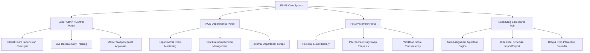
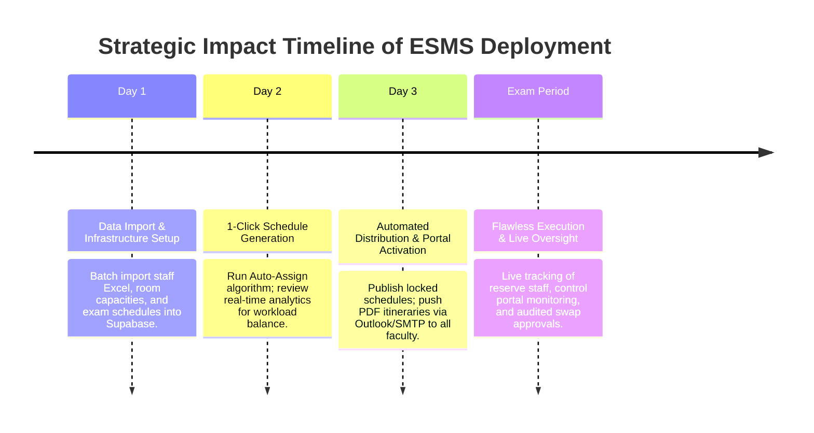

# Executive Managerial Overview & Strategic Digital Transformation Analysis
**Faculty Exam Supervision & Proctoring Management System (ESMS)**

---

### Executive Summary & Urgency Statement

In modern higher education institutions, administering examination supervision manually using spreadsheets, paper rosters, or ad-hoc messaging creates significant operational vulnerabilities. Faculty examination logistics involve managing hundreds of academic staff members across dozens of exam halls, balancing complex constraints (employment types, health conditions, feeding mother leaves, job titles, and oral vs. written exam formats), while guaranteeing absolute workload fairness.

The **Faculty Exam Supervision & Proctoring Management System (ESMS)** is a custom-engineered, enterprise-grade digital web application built to transition university faculty administration from error-prone, manual Excel workflows to an **automated, transparent, and audit-ready digital ecosystem**.

Deploying ESMS is a strategic imperative for faculty leadership (Deans, Vice Deans, Heads of Departments, and Exam Control Committees) to achieve **digital transformation, eliminate administrative bottlenecks, protect faculty well-being, and maintain flawless academic integrity**.

---

### 1. System Specifications & Technical Architecture

ESMS is built on a modern, high-performance tech stack designed for security, real-time reactivity, and seamless integration:

*   **Frontend Framework**: [Next.js 15 (App Router)](file:///d:/HUE/DEVELOPED%20SOFTWARE/Supervisors%20Automated%20Assign/app/page.tsx) with **TypeScript**, providing server-side rendering, client-side dynamic interactivity, and type safety across all operational modules.
*   **Styling & UI Design**: Custom **Tailwind CSS** implementation utilizing a curated color system (deep navy `#00122e`, gold accents, smooth micro-animations, responsive layout cards, and custom glassmorphism components).
*   **Database & Security Engine**: [Supabase PostgreSQL](file:///d:/HUE/DEVELOPED%20SOFTWARE/Supervisors%20Automated%20Assign/supabase/migrations/001_initial_schema.sql) with Row-Level Security (RLS), custom PostgreSQL functions/triggers, and automatic audit trail logging ([audit_log](file:///d:/HUE/DEVELOPED%20SOFTWARE/Supervisors%20Automated%20Assign/types/database.types.ts#L208)).
*   **State Management & Data Hydration**: **Zustand** for scheduling state persistence paired with **React Query** for real-time background cache revalidation.
*   **Document & Email Distribution**: [jsPDF](file:///d:/HUE/DEVELOPED%20SOFTWARE/Supervisors%20Automated%20Assign/lib/utils/report-generators.ts) and **html2canvas** for PDF/Excel generation, coupled with a hybrid email engine in [route.ts](file:///d:/HUE/DEVELOPED%20SOFTWARE/Supervisors%20Automated%20Assign/app/api/send-schedule/route.ts) supporting **SMTP (Nodemailer)** and native **Windows Outlook Desktop COM script integration** via PowerShell (`send-outlook.ps1`).

---

### 2. Multi-Portal Architecture & User Roles

ESMS provides role-tailored access portals ensuring each administrative stakeholder receives an interface optimized for their responsibilities:

1.  **Central Exam Control Portal ([app/control-portal/page.tsx](file:///d:/HUE/DEVELOPED%20SOFTWARE/Supervisors%20Automated%20Assign/app/control-portal/page.tsx))**:
    *   Designed for the Chief Exam Control Officer and administrative staff.
    *   Provides master control over daily hall rosters, reserve duty assignments, cross-departmental swap request resolution, and high-volume report exporting.
2.  **Head of Department (HOD) Portal ([app/hod-portal/page.tsx](file:///d:/HUE/DEVELOPED%20SOFTWARE/Supervisors%20Automated%20Assign/app/hod-portal/page.tsx))**:
    *   Allows HODs to monitor departmental staff assignments, manage oral exam invigilation, track internal swaps, and download department-specific PDF schedules.
3.  **Faculty & Teaching Staff Portal ([app/staff-portal/page.tsx](file:///d:/HUE/DEVELOPED%20SOFTWARE/Supervisors%20Automated%20Assign/app/staff-portal/page.tsx))**:
    *   A self-service hub for professors, lecturers, assistant lecturers, teaching assistants, and chemists.
    *   Features individual schedule views, reserve duty notifications, instant PDF download, and a built-in peer-to-peer duty swap request wizard.
4.  **Administrative & Analytics Hub ([app/analytics/page.tsx](file:///d:/HUE/DEVELOPED%20SOFTWARE/Supervisors%20Automated%20Assign/app/analytics/page.tsx))**:
    *   Executive analytics dashboard utilizing Recharts to visualize workload equity scores, role distribution histograms, daily student density, and building load balances.

---

### 3. Deep-Dive: The Intelligent Auto-Assignment Engine

At the heart of ESMS is the mathematical auto-assignment algorithm located in [auto-assignment.ts](file:///d:/HUE/DEVELOPED%20SOFTWARE/Supervisors%20Automated%20Assign/lib/algorithms/auto-assignment.ts). It enforces strict academic policies, physical constraints, and health requirements in milliseconds:

#### A. Dynamic Staffing Ratio Formula
Staffing requirements dynamically scale based on room enrollment:
*   **1 – 9 Students**: 1 Head Supervisor
*   **10 – 30 Students**: 1 Head Supervisor + 1 Invigilator/Assistant
*   **31 – 50 Students**: 1 Head Supervisor + 2 Invigilators/Assistants
*   **51 – 60 Students**: 1 Head Supervisor + 3 Invigilators/Assistants
*   **61+ Students**: 1 Head Supervisor + 4 Invigilators/Assistants
*   **Oral Exams Special Override**: Automatically set to 0 Head Supervisors + 1 Assistant.

#### B. Transparent Score-Based Workload Balancing
To guarantee fairness, every assignment increments a staff member’s score:
*   **Head Supervisor / Committee Supervisor Duty**: $+2.0\text{ points}$
*   **Invigilator / Assistant Duty**: $+1.0\text{ point}$
*   **Reserve / Period-Free Duty**: $+0.25\text{ points}$

The algorithm prioritizes candidates with the lowest effective score ($\text{Effective Score} = \text{Current Score} + 0.25 \times \text{Reserve Score}$). An optional hard workload cap (`max_score_delta_from_average`) locks staff members out from receiving additional duties if their score significantly exceeds the departmental average until peers catch up.

#### C. Role Hierarchy & Special Condition Rules
*   **Committees Supervisors (Multi-Room Coverage)**: Assigned during a pre-pass step. One Committees Supervisor handles up to 5 rooms across a maximum of 2 adjacent floors within the same building.
*   **Health Condition Spatial Priority**: Staff with flagged health conditions (`has_health_issue = true`) are automatically prioritized for exam halls in Buildings M and P (near pharmacy/medical facilities) and de-prioritized for far buildings.
*   **Feeding Mother Protection**: Tracks reduced working hours ($2\text{ hours}$ early leave for $2\text{ days}$ or $1\text{ hour}$ early leave for $4\text{ days}$) based on full-time/part-time status.
*   **Overload Factor Adjustments**: Decreases scheduling probability mathematically for overloaded staff members based on their overload percentage.
*   **Two-Phase Batch Assignment**:
    1.  *Phase 1*: Assigns Head Supervisors across all rooms first to ensure qualified senior staff are reserved.
    2.  *Phase 2*: Assigns Invigilators/Assistants from the remaining available pool.
    3.  *Phase 3*: Computes period-free reserves ($3–5$ backup staff per exam session slot) to handle unexpected absences.

---

### 4. Managerial Gap Analysis: Manual Administration vs. ESMS

The table below contrasts the traditional manual spreadsheet administration against the digital capabilities of ESMS, clearly demonstrating the **urgency of adopting ESMS for faculty digital transformation**:

| Operational Dimension | Status Quo: Manual Excel & Paper Rosters | ESMS Digital Transformation Solution | Operational & Strategic Impact |
| :--- | :--- | :--- | :--- |
| **1. Workload Equity & Bias** | High perception of favoritism; manual assignments frequently overload junior staff while senior members receive fewer shifts. | Algorithmic score-based distribution ([auto-assignment.ts](file:///d:/HUE/DEVELOPED%20SOFTWARE/Supervisors%20Automated%20Assign/lib/algorithms/auto-assignment.ts#L494)) ensures mathematical workload balance across all job titles. | Eliminates staff complaints, builds departmental trust, and ensures complete transparency. |
| **2. Human Error & Double Booking** | Spreadsheets cannot detect overlapping room assignments, double-booked professors, or back-to-back shift exhaustion. | Real-time constraint engine ([isStaffAvailable](file:///d:/HUE/DEVELOPED%20SOFTWARE/Supervisors%20Automated%20Assign/lib/algorithms/auto-assignment.ts#L188)) blocks double bookings and enforces maximum daily/weekly hours. | Prevents scheduling collisions, exam day panic, and faculty burnout. |
| **3. Special Health & Leave Compliance** | Health issues, feeding mother early leaves, and specific off-days are easily forgotten or mismanaged in manual lists. | Automated tracking of health facility proximity (Buildings M & P), feeding mother early leave quotas, and off-day constraints. | Guarantees 100% labor policy compliance and respects health/family accommodations. |
| **4. Sudden Staff Absence & Reserves** | Absent supervisors cause exam hall chaos, forcing admins to run through hallways looking for replacement proctors. | Intelligent Reserve Staff Engine ([allocateReserveStaff](file:///d:/HUE/DEVELOPED%20SOFTWARE/Supervisors%20Automated%20Assign/lib/algorithms/auto-assignment.ts#L1118)) automatically schedules 3-5 standby reserves per period. | Zero exam delays; hall coverage is guaranteed even during unforeseen illnesses. |
| **5. Duty Swap Management** | Informal verbal or WhatsApp swap agreements lead to unrecorded shifts, missing proctors, and zero accountability. | Formalized Swap Request Workflow ([app/swaps/page.tsx](file:///d:/HUE/DEVELOPED%20SOFTWARE/Supervisors%20Automated%20Assign/app/swaps/page.tsx)) with constraint checking and admin/HOD approval audit trails. | Complete administrative control with an immutable log of who was present. |
| **6. Schedule Distribution & Communication** | Admin staff spend hours cutting/pasting Excel tables into emails or posting paper notices on bulletin boards. | Automated dual-channel delivery via SMTP and Windows Outlook COM script ([send-schedule API](file:///d:/HUE/DEVELOPED%20SOFTWARE/Supervisors%20Automated%20Assign/app/api/send-schedule/route.ts)) delivering PDF itineraries directly to inboxes. | Reduces communication overhead by 95% and eliminates "I didn't receive my schedule" excuses. |
| **7. Preparation Time & Efficiency** | Building exam supervision schedules manually takes **3 to 5 full working days** per exam period. | **1-Click Auto-Assign Algorithm** generates complete, optimized schedules for hundreds of sessions in **under 10 seconds**. | **99.8% reduction in preparation time**, freeing administrative staff for strategic tasks. |
| **8. Audit Readiness & Version Control** | Multiple Excel files ("v1_final", "v2_corrected") cause confusion over which roster is active. | Single source of truth backed by Supabase with database schedule locking (`is_locked`) and audit logs ([audit_log](file:///d:/HUE/DEVELOPED%20SOFTWARE/Supervisors%20Automated%20Assign/types/database.types.ts#L208)). | Complete audit readiness for university accreditation and quality assurance reviews. |

---

### 5. Strategic ROI & Implementation Roadmap for Faculty Leadership

Investing in and deploying ESMS delivers immediate return on investment across three key managerial pillars:

1.  **Operational Excellence**: Transitioning from a multi-day manual process to a 10-second automated execution eliminates human bottlenecks during peak exam preparation weeks.
2.  **Faculty Satisfaction & Morale**: Transparent scoring and equal distribution protect teaching staff from burnout, promoting a culture of fairness and accountability.
3.  **Institutional Risk Mitigation**: Enforced building safety ratios, medical proximity matching, and legal leave compliance safeguard the university against legal and institutional risks.

---
*Generated for University Faculty Leadership & Academic Administration.*
